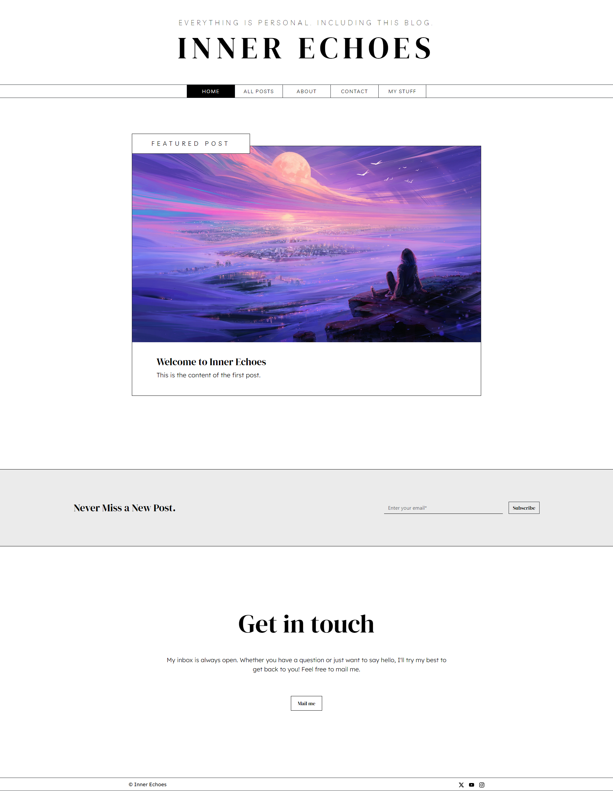

# Inner Echoes

Inner Echoes is a simple blog application built with Node.js and Express.js. It allows users to create, edit, and delete blog posts, as well as view posts in reverse chronological order.


## Screenshot




## Run Locally

Clone the project

```bash
https://github.com/vaibhavdekatey/Personal-Blog.git
```

Go to the project directory

```bash
  cd Personal-Blog
```

Install dependencies

```bash
  npm install
```

Start the server

```bash
  node index.js
```


## Features


- **Create New Posts:** Users can compose and publish new blog posts with a title and content.

- **Edit and Delete Posts:** Users have the ability to edit the content or title of existing posts, as well as delete posts they no longer wish to keep.

- **View Blog:** The blog page displays all posts in reverse chronological order, with a preview of each post's content.

- **View Individual Posts:** Users can click on a post to view it in its entirety, including any line breaks and formatting.

- **About Page:** Provides information about the blog and its purpose.
## Contributing

Contributions are always welcome!


